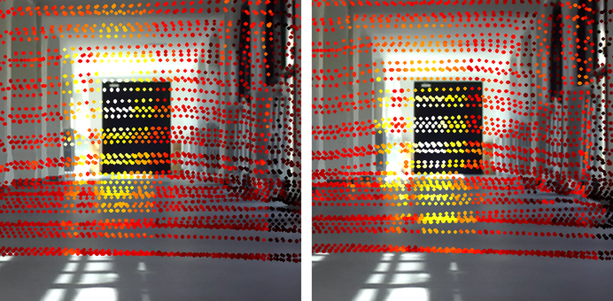

# MATLAB_SensorFusionValidation

Visual check that the LiDAR↔camera **extrinsics actually line up** on real scene
geometry, not just on the four calibration-target holes they were fitted to.

For a chosen synced triplet it projects the same LiDAR scan **twice** — once into
the FLIR, once into the ZED — then paints each ZED pixel with the FLIR value
sampled at the corresponding FLIR pixel. If the calibration is right, the thermal
colours land on the matching structures in the RGB image. If it drifts, you see
it immediately as thermal bleeding across an edge.

This is a **sanity check on the projection chain**, not the radiometric fusion
itself — that lives in `../SensorFusionLoader/`.

<p align="center">
  <br>
  <em>Session 12_50_10, pose 75 — FLIR values (colormap <code>hot</code>) sampled
  through the LiDAR cloud and scattered onto the ZED frame. Left: calib1
  extrinsics. Right: calib2. The warm patch of the open doorway sits on the
  doorway only in the right panel.</em>
</p>

| file | what it does |
|---|---|
| `FlirLidarZedViewer_calib1.m` | the viewer, session 9 + the `Exttr_tryN` **min3d** extrinsics. Loads a triplet, projects into both cameras, draws the overlay. Arrow keys step through poses without reopening the bag. |
| `FlirLidarZedViewer_calib2.m` | same viewer, NewAcquisitions ground-truth session `12_50_10` + the `NewCalibration` **min2d** extrinsics. |
| `output/` | saved PNGs, `flir_on_zed_<session>_pose<NN>.png`. Created automatically. |

The two files differ **only** in the hard-coded block at the top (paths + the two
`T_lidar_to_cam`); the projection chain is identical. Intrinsics are the same in
both: the NewCalibration session ran on the same `thermal_intrinsic.yaml` /
`zed_right_intrinsic.yaml`, i.e. the same MATLAB no-skew models.

## Usage

Needs an **interactive MATLAB desktop session**. It will not work under
`matlab -batch`: in batch the figure closes as soon as the function returns and
no event loop is left to listen for keys.

```matlab
cd 'C:\Users\loren\Desktop\Measurment_v2\ClaudeCode\RTM-EPlus\MATLAB_SensorFusionValidation'
FlirLidarZedViewer_calib2        % starts at pose 9
FlirLidarZedViewer_calib2(30)    % starts at pose 30  (0..116 on this session)
```

Keys (the figure window must have focus):

| key | action |
|---|---|
| `→` / `n` | next pose |
| `←` / `p` | previous pose |
| `s` | save the current frame to `output/` |
| `q` / close window | quit |

## What it does, step by step

1. Reads `sync_manifest.json` and picks the triplet at `S.idx` — FLIR file, ZED
   file, LiDAR timestamp and `/Odometry` pose, all already time-matched by
   `../TimeSyncCheck/`.
2. Pulls every `/cloud_registered` message within `±0.4 s` of that timestamp from
   the ROS2 bag and merges them (see *Scan accumulation* below).
3. Transforms the cloud **world → body**. `/cloud_registered` is published by
   FAST-LIO2 already in the world frame (`camera_init`), so it has to be brought
   back with the triplet's own pose: `p_body = R_wb' * (p_world - t_wb)`.
4. Applies the two extrinsics and projects with a pinhole + Brown–Conrady model
   (`projectPinhole`), keeping only points in front of the camera and inside the
   image bounds.
5. Runs a per-camera **z-buffer** to drop occluded points (`zBufferMask`).
6. Loads the raw radiometric FLIR frame from `.npy` (`readNpyFloat32`, a minimal
   built-in reader — no external dependency), maps it through `hot`, samples it
   at the projected FLIR pixels and scatters those colours over the ZED image.

## Baked-in calibration

Both extrinsics are hard-coded results, adopted from the LVT2Calib sessions:

`_calib1.m` — session `Exttr_tryN`, **min3d** fits:

| transform | poses used | min3D RMSE |
|---|---|---|
| LiDAR → FLIR | 6 clean (01,02,03,05,07,08) | 5.8 cm |
| LiDAR → ZED (right eye) | 8 (01,02,03,05,07,08,09,10) | 6.8 cm |

`_calib2.m` — session `NewCalibration`, **min2d** fits. min3d was rejected on
both pairs in that session because its translation jumps by 20-30 cm when a
single pose is dropped, while min2d stays within ~1 cm — and for this tool the
metric that matters is the reprojection, not the 3D distance:

| transform | poses used | min2D RMSE | reproj |
|---|---|---|---|
| LiDAR → FLIR | 8 (1,4,6,10,12,16,18,19), dropped by range discrepancy | 11.0 cm | 0.65 px |
| LiDAR → ZED (right eye) | 7 of 9 (3 and 10 dropped: a 266/287 mm side instead of 300) | 7.0 cm | 1.17 px |

Switching calib1 → calib2 moves the projection of the same cloud by **11-16 px
mean in the ZED** (du ≈ −10 to −13, dv ≈ −6 to −9, max ~25 px) and **13-16 px in
the FLIR** (du ≈ −8.9 constant, dv ≈ −9.6 to −13.5), i.e. the thermal value each
LiDAR point picks up changes as well as where it is drawn. See
`output/calib1_vs_calib2_125010_pose75*.png`.

Intrinsics are the **no-skew** MATLAB models: FLIR Vue Pro R 336×256, ZED 2i
right eye 1080p. Same values as `../SensorFusionLoader/rig_calibration.yaml` —
if you recalibrate, update both.

> On that RMSE: it is dominated by the **depth** component. The alignment error
> in LVT2Calib is reported in the `stereo` frame (ROS REP-103, x = forward), so
> `RMSE_x` *is* the depth error — the expected weak axis of a monocular pose
> estimate from a planar target. Lateral error is ~6 mm against ~67 mm in depth.

## Gotchas worth knowing

**FLIR is mounted upside down.** The images were rotated 180° *before* corner
detection during extrinsic calibration, and the original K (fitted on
un-rotated images) was reused as-is, **without** re-centring `cx`/`cy` on the new
grid. This script deliberately replicates that convention — same `*_rot180*`
folder, same un-recentred K — because that is the convention `Tr_laser_to_cam`
was actually estimated under. Re-centring here would introduce an inconsistency
with the extrinsics, not fix one. Verified empirically: >99 % of LiDAR points
project inside the FLIR bounds this way.

**Scan accumulation.** The Livox HAP scans non-repetitively, so a single
`/cloud_registered` message (~0.2 s) only covers partial bands of the scene —
hence the wide stripes on the overlay. `S.lidarAccumHalfWindow_s = 0.4` merges
the neighbouring scans to densify it. All of them are transformed with the
*same* `/Odometry` pose, which assumes the rig is near-stationary over that
window: widen it for more points, at the cost of motion blur.

**Occlusion filter is not optional.** FLIR and ZED sit ~13 cm apart on the rig,
so near an edge they see "around the corner" differently. Without the z-buffer a
wall point hidden from the FLIR but geometrically inside its frustum still gets
sampled, picking up the colour of the foreground edge — clearly visible at
session 9 poses 71 and 106. `S.zBufferTol_m = 0.08` is deliberately the same
order as the calibration RMSE.

**The overlay is only as good as the ZED clock.** A misalignment that changes
from pose to pose is a *timing* problem, not a calibration one: the LiDAR pose
and the ZED frame it is drawn on are then simply not the same instant. The
`fullrate/` timestamps written by `extract_fullrate_frames.py` are a uniform
grid and drift by several hundred ms across a session — run
`TimeSyncCheck/retime_fullrate_frames.py` and regenerate the manifest before
reading anything into what you see here. Session 9 was off by 0.35 s on
average (0.57 s worst), i.e. ~25 cm of walking, before that fix.

**`lidarAccumHalfWindow_s` must stay at one scan while walking.**
`/cloud_registered` is 5 Hz, so the old 0.4 s merged four scans spanning 0.8 s.
The merged points are at the right world coordinates, but they were observed
from up to 28 cm away (0.7 m/s at the end of session 9), so the merge
reintroduces surfaces that are occluded from the pose being rendered. The 8 cm
z-buffer is far too tight to reject them: they sample the thermal pixel of
whichever foreground surface they sit behind, and the hot pattern smears
sideways off the structure it belongs to. The artefact is zero while standing
still and grows with speed, so it reads as drift accumulating over a session
when it is really just the walking pace increasing. 0.1 s (one scan) is sharp;
raise it only for stationary poses.

**Body frame is assumed equal to the LiDAR frame.** No separate IMU–LiDAR
extrinsic is known for this rig. The resulting error is expected to be small but
has not been quantified.

## Requires

MATLAB with:

| function | toolbox |
|---|---|
| `ros2bagreader`, `readMessages`, `rosReadXYZ` | ROS Toolbox |
| `quat2rotm` | Navigation / Robotics System Toolbox |
| `mat2gray`, `ind2rgb`, `imshow`, `imread` | Image Processing Toolbox |

## Data it reads

Paths are hard-coded at the top of each file (`sessionRoot` and below), not
tracked in this repo.

`_calib1.m`, under `Dati_vfinal\SLAM\`:

```
ZED/20260730_161223/fullrate/sync_manifest.json   triplets + /Odometry poses
ZED/20260730_161223/fullrate/frames/              ZED RGB frames
Flir/session9_only_rot180/                        FLIR .npy, already rotated 180°
Lidar/rosbag2_2026_07_30-18_12_20/                ROS2 bag, /cloud_registered
```

`_calib2.m`, under `Dati_vfinal\NewAcquisitions\AcquistionGroundTruth\`:

```
Zed/20260911_105024/sync_manifest.json            triplets + /Odometry poses
Zed/20260911_105024/frames/                       ZED RGB frames
Flir/session_125010_rot180/                       FLIR .npy, already rotated 180°
Lidar/rosbag2_2026_09_11-12_50_10/                ROS2 bag, /cloud_registered
```

The calib2 ZED folder is the recorder's own output, **not** a `fullrate/`
export: each frame already carries its measured `t_offset_s`, so
`retime_fullrate_frames.py` does not apply. Its FLIR folders were rebuilt from
`Flir/20251019_180000` (whose clock is wrong — date 2025-10-19, time ≈ UTC +
7h18m; the event offset absorbs it) with:

```
py ../LVTCalibConversion/rotate_flir_poses.py --pose-dir <...>\Flir\session_125010 --npy
```

`rotate_flir_poses.py --npy` writes `<name>_R.npy`, but both consumers of the
convention (`RadiometricCalibration/correct_session.py:139` and the `erase(…,'_R')`
in these viewers) look for `<name>.npy` — the `_R` has to be dropped after the run.
