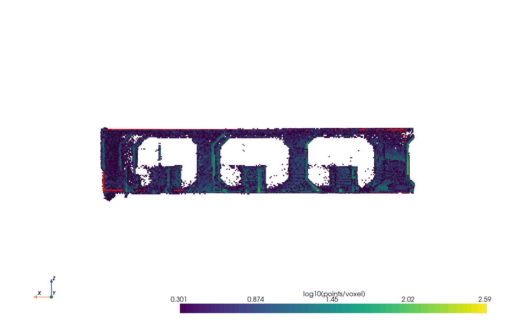
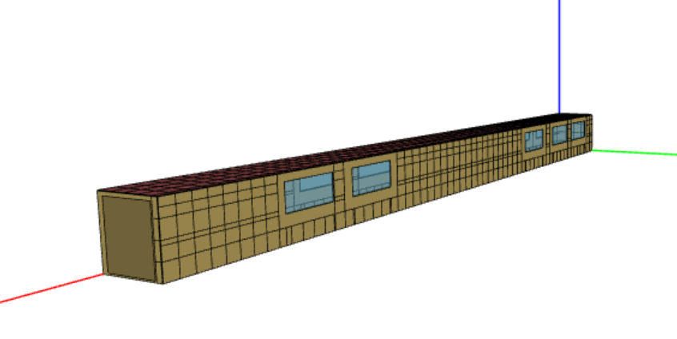
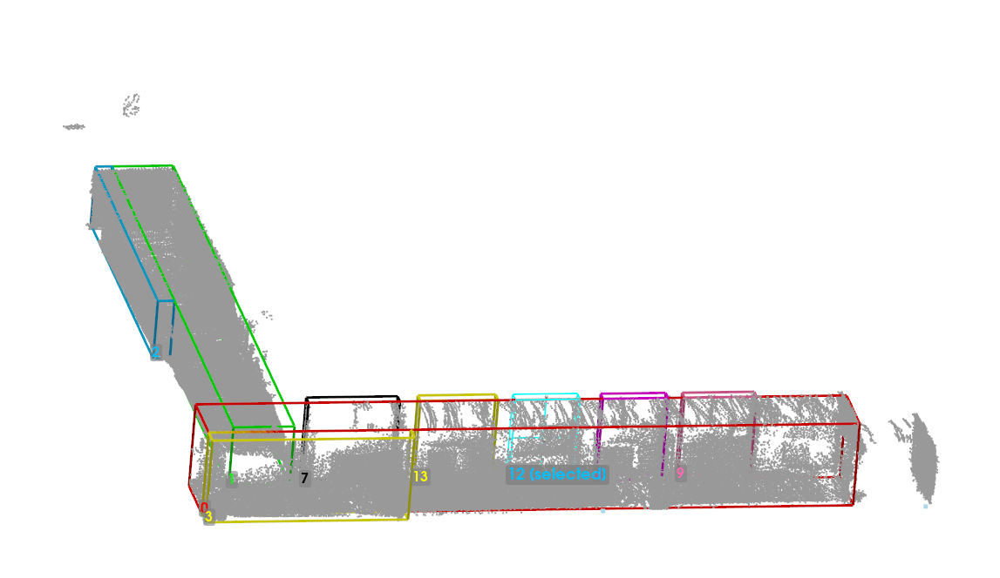
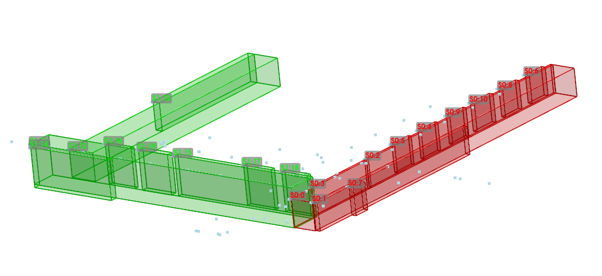
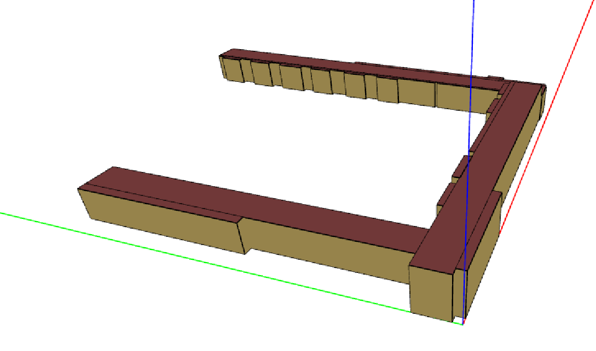
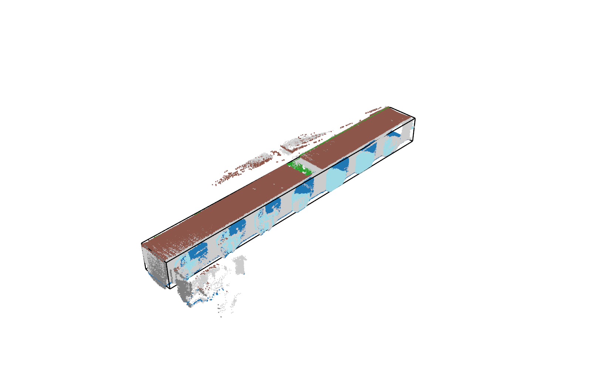
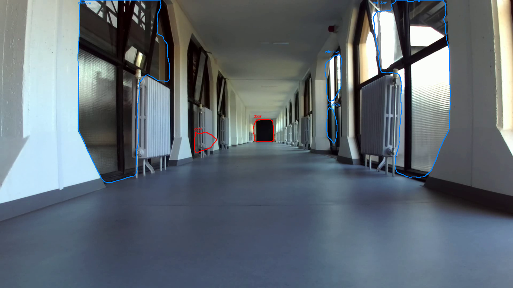
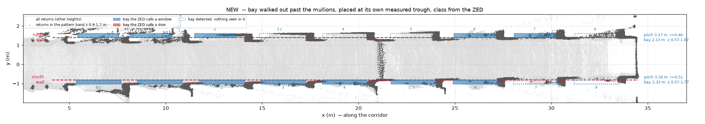
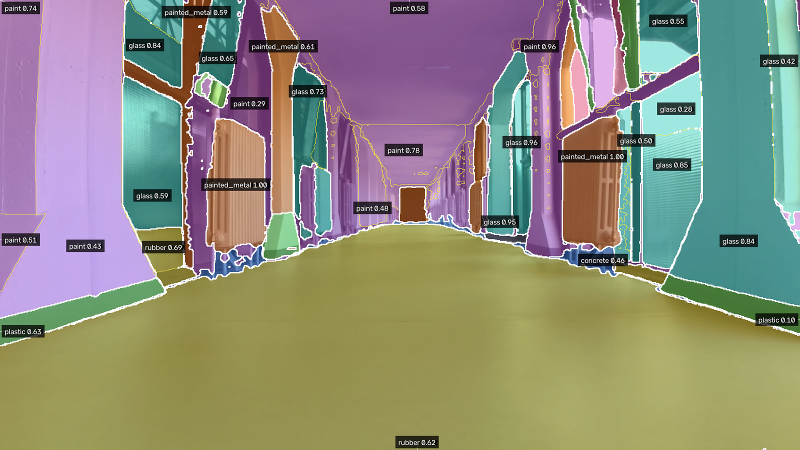
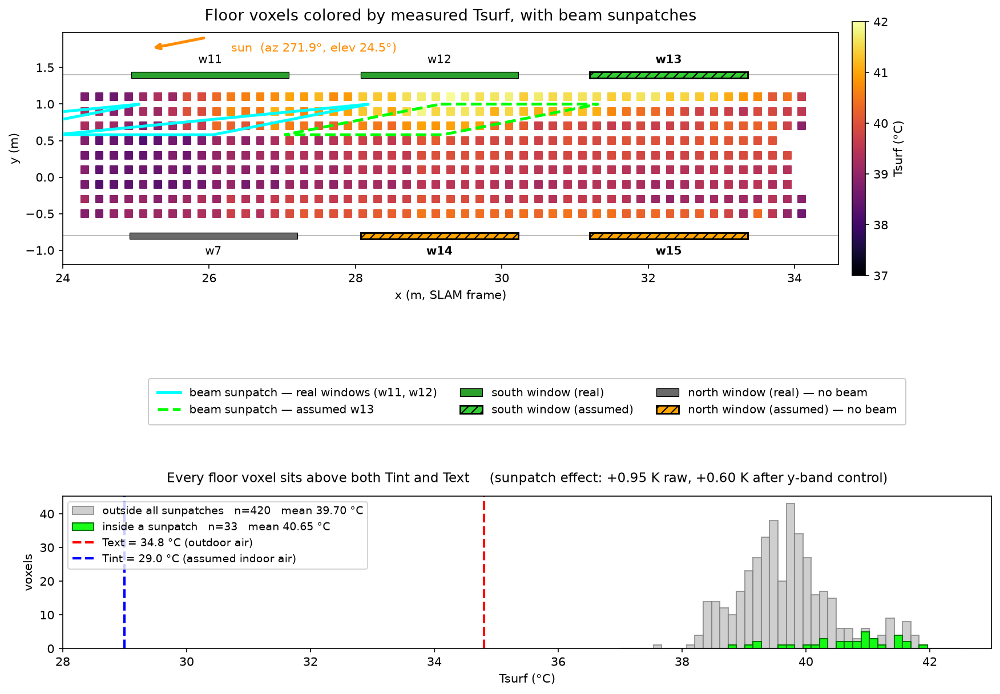

# Measured per-voxel U-values from LiDAR + thermal imaging → OpenStudio

Master's thesis pipeline. It takes a handheld survey of a building — LiDAR,
stereo RGB and a radiometric thermal camera, all on one rig — and produces an
**OpenStudio energy model whose surfaces carry U-values measured in the field**,
tile by tile, rather than assumed from a construction catalogue.

The **whole first floor** of the building was surveyed and reconstructed. The
thermal and U-value analysis then concentrates on the **final stretch of the
hall** — a ~34 m glazed corridor, captured on 2026-07-30 at 18:12 local time —
because that is the section covered by a complete, time-synced LiDAR + ZED +
FLIR triplet set. Everything from §3 onward refers to that stretch.

<p align="center">
  <br>
  <em>The survey, voxelised: ~1.07 M LiDAR points reduced to occupied voxels,
  coloured by log₁₀(points/voxel). Everything downstream is computed per voxel.</em>
</p>

## The final output

<p align="center">
  <br>
  <em><code>session9_u_filled.osm</code> — every exterior wall and roof split into
  tiles, each one a separate Surface with its own Construction, because a
  Construction is the only way OpenStudio can carry more than one U across one
  wall. Windows and doors stay attached as SubSurfaces.</em>
</p>

768 tiles over 212 m²: **274 measured** directly from voxels, **474
neighbour-filled** (interpolated from touching tiles, and labelled as such —
`__NFILL<ring>` in the name, `__NEIGHBOR_FILLED` on the construction), 20 left
bare where no measurement exists anywhere on that wall.

The model forward-translates and runs on EnergyPlus 25.2 with 0 severe errors.
It is **not** yet runnable unassisted — see [Honest limitations](#honest-limitations).

## How it works

```
                LiDAR bag ──┐
      ZED stereo frames ──┼── TimeSyncCheck ──► sync_manifest.json
     FLIR radiometric ──┘                              │
                                                       ▼
  ┌───────────────── geometry ─────────────────┐  ┌──── thermal / material ────┐
  │ PointCloudFilterGUI    filtered cloud      │  │ classify_session.py  CLIP  │
  │ OcTreeVoxel            planes + voxels     │  │ project_to_flir.py   fuse  │
  │ WindowsDoorsDetection  openings.json       │  │ correct_session.py   ε, τ  │
  │ fit_boxes → to_openstudio   .osm + windows │  │ voxel_consensus.py   voxel │
  └────────────────────┬───────────────────────┘  └─────────────┬──────────────┘
                       │                                        │
                       │        SolarIrradianceCorrection       │
                       │   voxel_u_value.py → voxel_solar_ns.py │
                       │        (sol-air, pvlib/Erbs/Perez)     │
                       │                                        │
                       └──────────► assign_u_to_osm.py ◄────────┘
                                            │
                                   session9_u.osm
```

### 1. Building the first-floor geometry

`fit_boxes.py` tiles the floor footprint of every hall into axis-aligned boxes,
`interactive_boxes.py` lets them be corrected by hand, `merge_boxes.py` aligns
several survey sessions into one file, and `to_openstudio.py` turns the result
into an `.osm`. Boxes sharing a `hall` id become one Space/ThermalZone; touching
boxes are left open to each other rather than getting a wall between them.

<p align="center">
  
  <br>
  <em><strong>Left:</strong> boxes fitted over the first-floor cloud, one per
  span. <strong>Right:</strong> two separate survey sessions (green S1, red S0)
  merged into a single consistent set — <code>merge_boxes.py</code> aligns the
  boxes with a translate-only drag per session.</em>
</p>

<p align="center">
  <br>
  <em>The full first floor as an OpenStudio model. The <strong>far wing running
  to the right</strong> is the stretch of hall everything below focuses on.</em>
</p>

### 2. Planes and voxels

For that stretch, `fit_closed_planes.py` fits the closed 6-plane box and
`aligned_octree.py` levels the cloud into that building frame before voxelising.

<p align="center">
  <br>
  <em>The fitted 6-plane closed box over the cloud. Blue patches are the
  window/door returns that the next step turns into openings.</em>
</p>

### 3. Windows and doors

Every ZED frame is segmented; the window/door masks are projected onto the LiDAR
cloud, voted per voxel, and only then regularised into rectangles — no single
frame is ever trusted on its own.

<p align="center">
  <br>
  <em>Per-frame recognition on the ZED image: windows in blue, doors in red.
  These outlines are what gets projected onto the cloud and voted per voxel.</em>
</p>

<p align="center">
  <br>
  <em>The result, top-down: detected bays on the north and south walls. Solid =
  the ZED classified it, dotted = a bay was detected geometrically but nothing
  was seen in it. Bay pitch recovers at 3.17 / 3.18 m on the two walls
  independently — they were never told about each other.</em>
</p>

### 4. Material recognition and thermal correction

FLIR apparent temperature is corrected per pixel for emissivity, reflected
temperature and atmospheric transmission, using **each pixel's own LiDAR
distance** and **its own material**. Materials come from SAM segmentation plus
CLIP zero-shot classification against `emissivity_table.csv`, constrained by a
zone prior, and the corrected temperatures are then averaged per voxel.

<p align="center">
  <br>
  <em>Material recognition: SAM regions classified by CLIP, each labelled with
  its material and confidence. Glass, paint, painted_metal (the radiators),
  rubber, plastic and concrete are separated — and it is the per-region
  emissivity that the radiometric correction then uses, not one value for the
  whole frame.</em>
</p>

There is **no direct FLIR↔ZED calibration anywhere**: LiDAR is the bridge
between the two image planes. For every LiDAR point visible in both frustums,
the material is read off the ZED-side classification and written at that point's
own FLIR pixel.

### 5. U-value, with the sun accounted for

`voxel_u_value.py` gives the base
`U = hsi·(Tint − Tsurf) / (Tint − Text)`. `voxel_solar_ns.py` then places the
solar gain where the sun physically is — on the **outside** face — via the
sol-air temperature, `T_sol_air = Text + α·I/he`. This leaves no free parameter:
`he` is normative, `α` comes from the material table, `I` from pvlib.

<p align="center">
  <br>
  <em>Sunlight arriving <em>through</em> the glazing: each window aperture
  projected along the sun ray onto the floor. Voxels inside a patch sit +0.60 K
  above the rest of the floor after controlling for the y-band — a real but
  modest effect. (Produced by <code>voxel_solar_floor.py</code>, whose U
  correction did not survive; see that module's README.)</em>
</p>

### 6. Onto the model

`assign_u_to_osm.py` lays a grid over each exterior surface, snaps the grid onto
every opening edge so no window straddles a tile boundary, reserves a host
rectangle around each opening, and gives every remaining cell its own Surface
and Construction from the U measured there.

## Repository layout

Each folder has its own README and `requirements.txt`.

| folder | what it does |
|---|---|
| [`DataAcquisition/`](DataAcquisition) | recording the ZED session; recovering every frame at the real measured fps |
| [`TimeSyncCheck/`](TimeSyncCheck) | builds `sync_manifest.json` — the LiDAR/ZED/FLIR triplets everything downstream iterates over |
| [`IntrinsicCalibration/`](IntrinsicCalibration) | ZED and FLIR intrinsics (capture in Python, calibrate in MATLAB) |
| [`LVTCalibBoardGenearation/`](LVTCalibBoardGenearation) | PCD templates for the LVT2Calib board, with the real board geometry |
| [`SensorFusionLoader/`](SensorFusionLoader) | **the canonical rig calibration** + generic LiDAR→camera projection. Imported, never run |
| [`RadiometricCalibration/`](RadiometricCalibration) | FLIR apparent → true temperature, per pixel, per session |
| [`EmissivityCalculation/`](EmissivityCalculation) | CLIP material classification per superpixel, projected onto FLIR pixels via LiDAR |
| [`PointCloudElaboration/`](PointCloudElaboration) | filtering → planes → voxels → openings → per-voxel U (5 sub-steps, own README) |
| [`3DModelPointCloudExtraction/`](3DModelPointCloudExtraction) | boxes → `.osm`, openings as SubSurfaces, and `assign_u_to_osm.py` |
| [`MATLAB_PointCloudVisualization/`](MATLAB_PointCloudVisualization) | MATLAB viewers for a raw bag, inspection only |

## Environments

There is no single venv — the modules have genuinely incompatible dependency
sets (CLIP/torch vs. Open3D vs. OpenStudio), so each has its own:

| venv | used by |
|---|---|
| `C:\venvs\planefit` | OcTreeVoxel, SolarIrradianceCorrection, 3DModelPointCloudExtraction |
| `C:\venvs\emissivity` | EmissivityCalculation (torch/CLIP; short path because torch's install exceeds Windows' 260-char limit) |
| `C:\venvs\sensorfusion` | project_to_flir, correct_session, SensorFusionLoader |

## Honest limitations

Stated here rather than buried, because they bound what the output means.

**The two root causes.** Almost everything below follows from the same two
facts, and neither is a fault in the code:

1. **The survey was taken outside the conditions the standards assume.** The
   capture is a single instant, 2026-07-30 at **18:12**, in cooling season with
   the sun still 24.5° above the horizon. Measured indoor air was **29 °C**
   against **34.8–36.9 °C** outdoors, i.e. **ΔT ≈ 6–8 K**. In-situ U measurement
   (ISO 9869-1) and building thermography (ISO 6781 / EN 13187) both assume a
   **larger and sustained** ΔT — around 10 K as a working minimum — held over
   hours to days, with the envelope free of recent solar loading. Neither
   condition held here. Because
   `U = hsi·(Tint − Tsurf) / (Tint − Text)` divides by that ΔT, a small
   denominator amplifies every error in `Tsurf`: a few tenths of a kelvin of
   residual emissivity, reflected-temperature or stored-solar error is enough to
   push the result far above any physically representable value. **That, not a
   modelling bug, is why so many tiles come out unphysical.**
2. **The scan does not cover every surface.** 562 of 2246 voxel rows carry no
   usable U at all, and only **34 % of the tiled area** is backed by voxels the
   thermal camera actually saw. The rest is interpolated or bare. A handheld
   survey at walking pace, with a narrow-FOV FLIR, simply does not see every
   patch of every wall.

**What that produces:**

- **499 of 768 tiles exceed the film-only ceiling.** With `hsi`=7.7 and `he`=25,
  `1/hsi + 1/he` = 0.170 m²K/W, so no air-to-air U above **5.89 W/m²K** is
  representable by any opaque construction. Tiles above it are tagged
  `__UNPHYSICAL` and given a minimal resistance rather than silently clamped —
  they are a flag, and per cause (1) it is the **measurement conditions** that
  need revisiting, not the model. A repeat survey at night or in the heating
  season, with ΔT ≥ 10 K and no solar loading for several hours beforehand,
  is the fix.
- **63 % of tiles by area are interpolated**, not measured — cause (2).
  Labelled everywhere (`__NFILL<ring>`, `__NEIGHBOR_FILLED`, `u_source`), but
  the fill in the current run reaches 40 rings from the nearest real
  measurement; cap it with `--fill-max-rings` if that matters.
- **35 objects still have no construction** — both floors (excluded from
  tiling), 20 bare tiles on walls the scan never covered, and all 13
  windows/doors. EnergyPlus fatals until they are given one.
- **No thermal mass.** Every construction is a `MasslessOpaqueMaterial`, because
  a measured U carries no capacitance. E+ warns accordingly. This model supports
  steady-state comparison; dynamic results from it would be unfounded.

So: the geometry, the fusion and the assignment machinery are exercised end to
end and behave as intended — but **the U values themselves are demonstrations of
the method, not a validated thermal survey of this building.** Treating them as
the latter would require a re-measurement under ISO-compliant conditions.

## External projects used

This repository contains the pipeline, not re-implementations of the tools it
builds on. Three external projects are involved, and the code here is the glue
that prepares their inputs and parses their outputs:

| project | what it is | how it is used here |
|---|---|---|
| **[LVT2Calib](https://github.com/Clothooo/lvt2calib)** | automatic extrinsic calibration between LiDAR and visual cameras, using a board with four circular holes | **This is what the rig was calibrated with.** The LiDAR↔FLIR and LiDAR↔ZED extrinsics in [`SensorFusionLoader/rig_calibration.yaml`](SensorFusionLoader) come from an LVT2Calib board-pose session (RMSE ~6 cm). [`LVTCalibBoardGenearation/`](LVTCalibBoardGenearation) generates the PCD templates it matches against, with the real geometry of the board actually built (100 × 70 cm, four ⌀13 cm holes) instead of the stock one. |
| **[VOSTOK](https://github.com/3dgeo-heidelberg/vostok)** | voxel-based raycasting for solar/sky visibility on point clouds (3DGeo, Heidelberg) | Drives the per-voxel sunlit/occluded mask in [`…/SolarIrradianceCorrection/Vostok/`](PointCloudElaboration/SolarIrradianceCorrection/Vostok). Built from source (see that folder's README for the MinGW/CMake workarounds); the Python there only prepares its inputs and parses its shadow files. |
| **V-LOAM** | visual-LiDAR odometry — Zhang & Singh 2015, *"Visual-lidar Odometry and Mapping: low-drift, robust and fast"* | Implemented here from the paper (no upstream repo used) in [`3DModelPointCloudExtraction/V-LOAM/`](3DModelPointCloudExtraction/V-LOAM), Python prep + MATLAB association/VO. |

## Unconnected branches

Two of the above are finished work that no pipeline step consumes. They are kept
and clearly marked rather than deleted:

- [`PointCloudElaboration/SolarIrradianceCorrection/Vostok/`](PointCloudElaboration/SolarIrradianceCorrection/Vostok) —
  the VOSTOK shadow mask. It is exactly the missing input for a shadow-aware
  irradiance term, but nothing reads it yet.
- [`3DModelPointCloudExtraction/V-LOAM/`](3DModelPointCloudExtraction/V-LOAM) —
  the model is built on FAST-LIO / Livox SLAM poses instead. The ablation
  results are kept as thesis material.

LVT2Calib, by contrast, **is** in the live path — everything that projects a
LiDAR point into a camera image depends on the extrinsics it produced.
